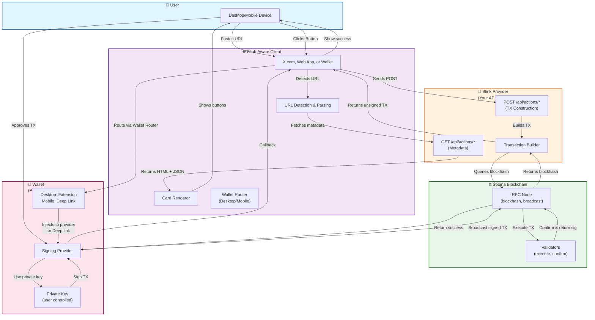

# Solana Blinks: Sequence & Architecture Diagrams

## 1. Sequence Diagram: Blink Execution Flow

**What it shows:** The step-by-step temporal flow of how Blinks work from user perspective to on-chain confirmation.

**How to use:**
1. Go to https://sequencediagram.org/
2. Copy the code below
3. Paste into the left editor pane
4. Watch the diagram render on the right

**Code:**

```
title Solana Blinks - Sequence Diagram

participant User
participant X["X.com\n(Blink-capable client)"]
participant Provider["Blink Provider\n(Your API)"]
participant Wallet["Wallet\n(Phantom / etc.)"]
participant RPC["Solana RPC"]

Note over User,RPC: Phase 1: Sharing & Unfurl (Preview Phase)

User->>X: Paste Blink URL
X->>Provider: GET /api/actions/donate
Note right of Provider: Returns HTML\n(OG tags + embedded action JSON)
Provider-->>X: Metadata\n(title, image, description, actions)
X->>User: Render card\n(image + text + button)

Note over User,RPC: Phase 2: Execution Phase (on click)

User->>X: Click "Donate 0.1 SOL"
X->>Provider: POST /api/actions/donate
Note right of Provider: Build transaction\n(fetch blockhash, construct tx)
Provider->>RPC: getLatestBlockhash()
RPC-->>Provider: blockhash
Provider-->>X: { type: "transaction",\ntransaction: base64 }

Note over User,RPC: Phase 3: Wallet Bridge (environment-dependent)

alt Desktop (extension present)
  X->>Wallet: window.solana.signAndSendTransaction(tx)
  Note right of Wallet: Injected provider\n(e.g., Phantom)
else Mobile (no injection)
  X->>Wallet: Deep link\n(phantom://signTransaction?tx=...)
end

Note over User,RPC: Phase 4: Signing & Settlement

Wallet->>User: Show confirmation UI
User->>Wallet: Approve
Wallet->>RPC: Send signed transaction
RPC-->>Wallet: Tx confirmed\n(signature)
Wallet-->>X: Result / callback
X->>User: Show success\n(TxHash + Solscan link)
```

---

## 2. Architecture Diagram: Blink System Components

**What it shows:** The static structure and relationships between Blink ecosystem components.

**How to use:**
1. Go to https://mermaid.live/
2. Copy the code below
3. Paste into the left editor pane
4. Watch the diagram render on the right

**Code:**



---

## Key Differences

| Aspect | Sequence Diagram | Architecture Diagram |
|--------|------------------|----------------------|
| **Shows** | Timeline of operations | System structure & relationships |
| **Focus** | Order: what happens when | Layout: how components connect |
| **Timeline** | Yes (top-to-bottom flow) | No (static view) |
| **Use Case** | Understanding flow/debugging | System design/documentation |
| **Tool** | sequencediagram.org | mermaid.live |

---

## Quick Links

- [View Sequence Diagram on sequencediagram.org](https://sequencediagram.org/)
- [View Architecture Diagram on mermaid.live](https://mermaid.live/)
- [Technical White Paper](./TECHNICAL_WHITEPAPER.md) — detailed implementation guide
- [Solana Actions Spec](https://solana.com/docs/core/actions) — protocol reference
